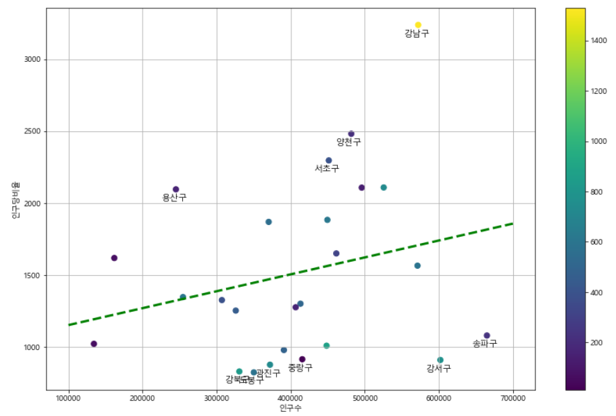
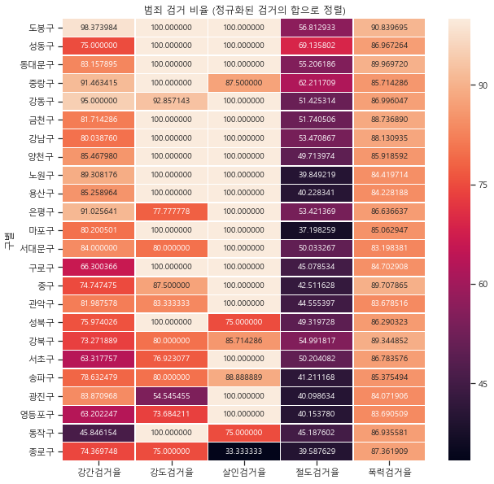
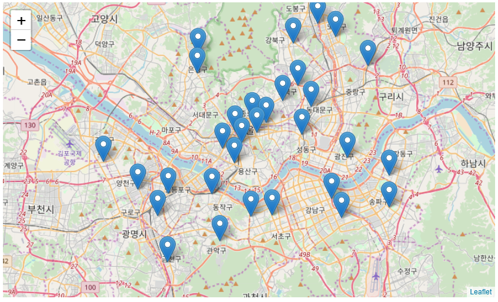
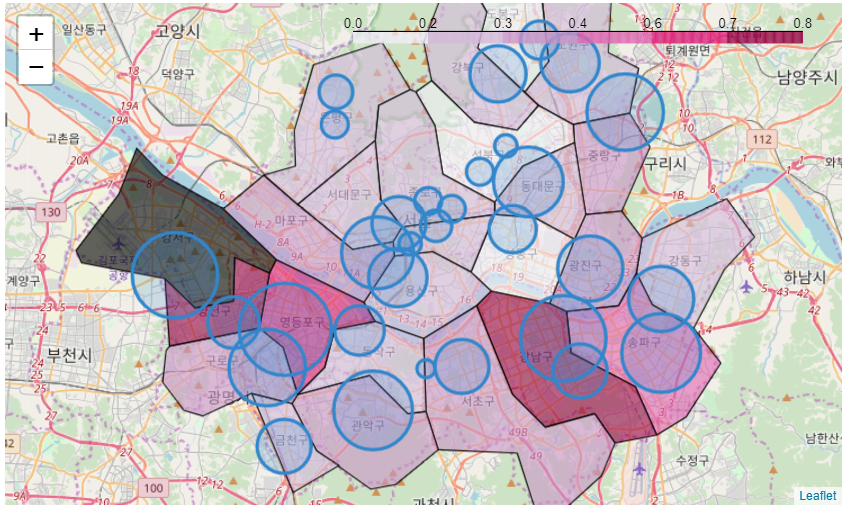

## Handling Data using Python
    
  
## 파이썬으로 데이터 주무르기 
### 독특한 예제를 통해 배우는 데이터 분석 
### 저자 : 민형기  

 
 
 

## 목차
> 1. 서울시 구별 CCTV 현황 분석
> 2. 서울시 범죄 현황 분석
> 3. 시카고 샌드위치 맛집 분석
> 4. 셀프 주유소는 정말 저렴할까
> 5. 우리나라 인구 소멸 위기 지역 분석
> 6. 19대 대선 결과 분석
> 7. 시계열 데이터를 다뤄보자
> 8. 자연어 처리 시작하기

 
 

### 1장. 서울시 구별 CCTV 현황 
  

* 서울시 구별 인구수와 CCTV의 비율 알아보기
* `pandas`와 `matplotlib` 사용 방법 익히기

### 2장. 서울시 범죄 현황 분석 
  
 

* 서울시 경찰서별 검거율과 구별 범죄 발생율 시각화하기
* `seaborn`패키지를 이용하여 시각화하기
* 지도 시각화 도구 `folium` 소개

### 3장. 시카고 샌드위치 맛집 분석
### 4장. 셀프 주유소는 정말 저렴할까
### 5장. 우리나라 인구 소멸 위기 지역 분석
### 7장. 시계열 데이터를 다뤄보자
### 8장. 자연어 처리 시작하기

